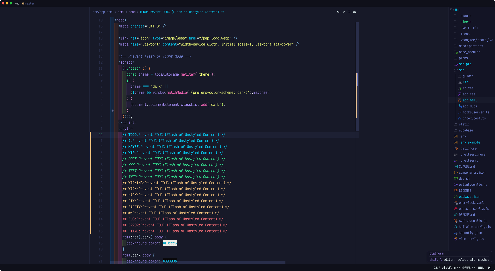
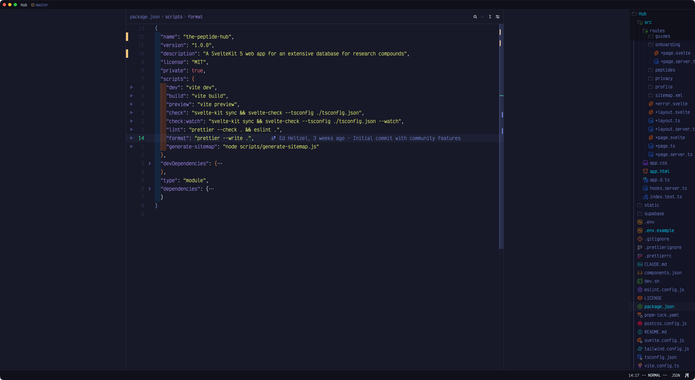
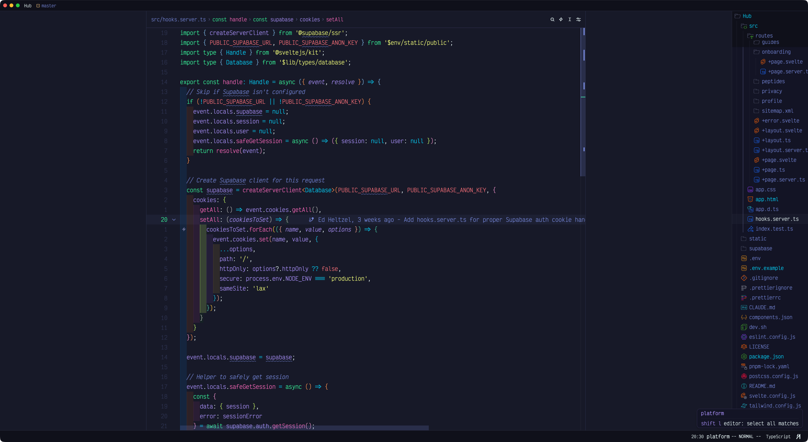
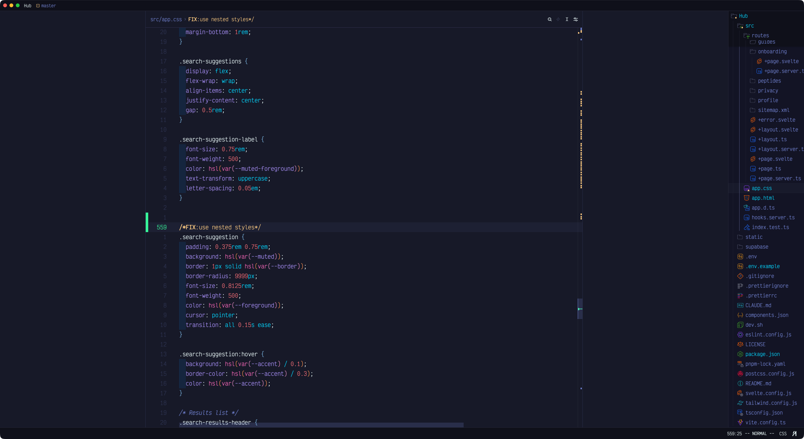
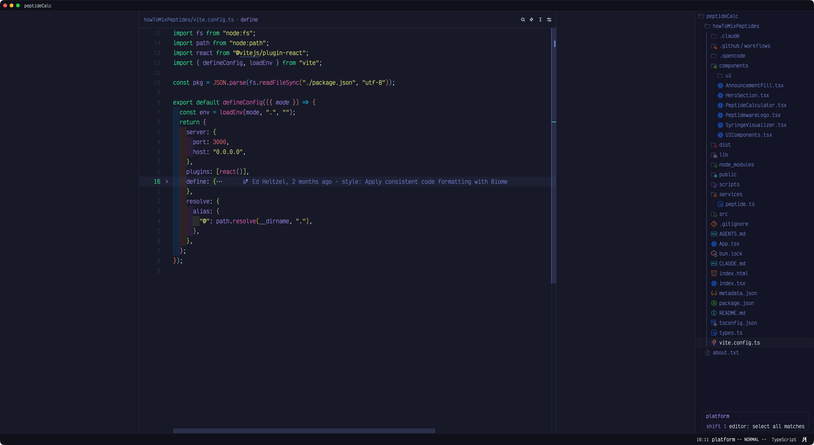
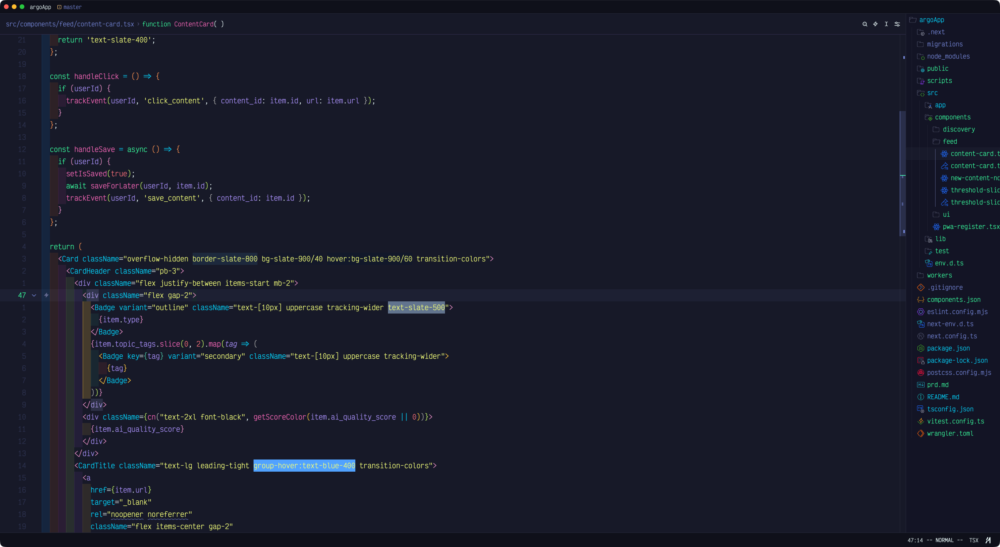
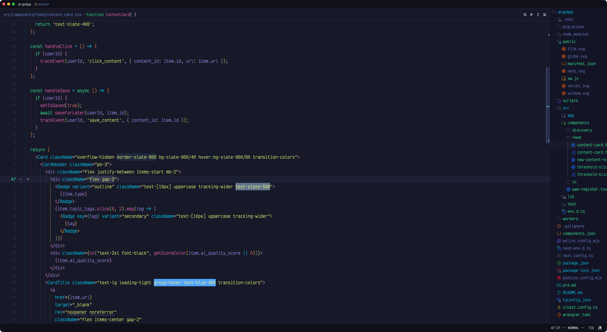
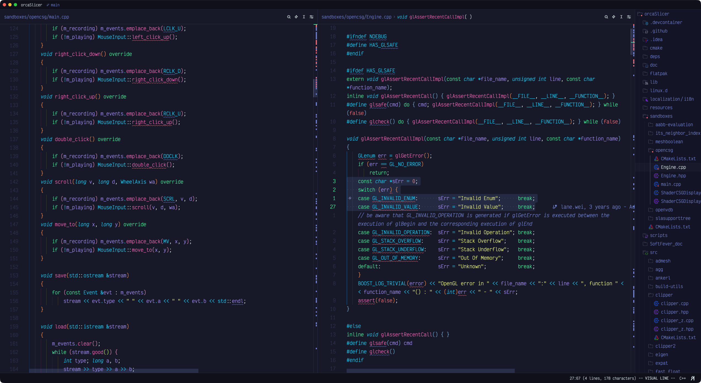
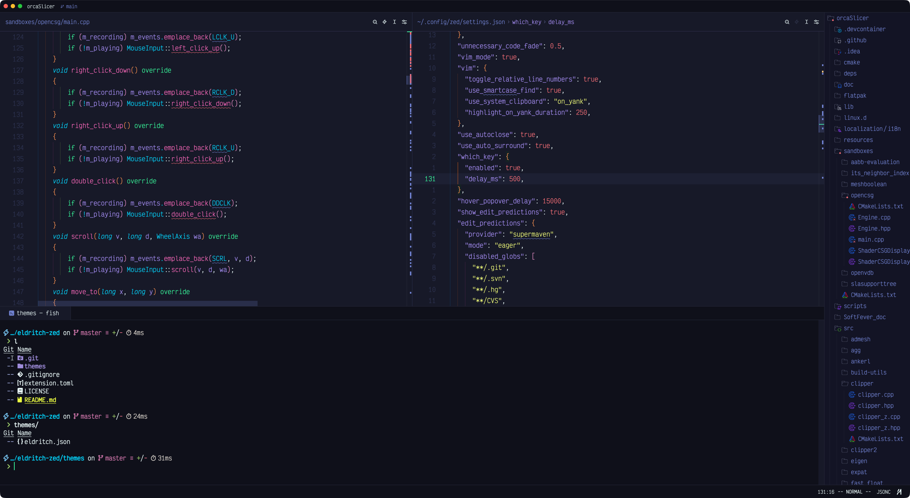

<p align="center">
  
</p>

# Eldritch for [Zed](https://zed.dev)

> A community-driven theme inspired by Lovecraftian horror — now with dark **and** light variants.

Ported from [eldritch.nvim](https://github.com/eldritch-theme/eldritch.nvim) with Neovim-matched syntax highlighting across 200+ languages.

For more information, see the main [Eldritch](https://github.com/eldritch-theme/eldritch) theme repository.

## Variants

This release drops the old alias names and uses four clear palette names:

| Variant | Appearance | Palette basis | Description |
|---------|------------|---------------|-------------|
| **Eldritch** | dark | Cthulhu | The default Cthulhu palette — vibrant accents on the sunken-depths background |
| **Eldritch Midnight** | dark | Midnight | Formerly **Eldritch Deeper** — vibrant Cthulhu accents on the darker Void Black background |
| **Eldritch Abyss** | dark | The Abyss | Formerly **Eldritch Dark** — darker background with more muted, desaturated accents |
| **Eldritch Dusk** | light | Dusk | The light version, tuned for legibility on a pale coastal background |

If you used **Eldritch Dark**, switch to **Eldritch Abyss**. If you used **Eldritch Deeper**, switch to **Eldritch Midnight**.

## Showcase

| | |
|:---:|:---:|
|  |  |
| HTML — Dark mode script | JSON — package.json |
|  |  |
| TypeScript — Supabase SSR hooks | CSS — Nested rules and custom properties |
|  |  |
| TypeScript — Vite config | TSX — React component with Tailwind |
|  |  |
| TSX — React component (Abyss variant) | C++ — Split pane with parser macros |
|  | |
| C++ / JSON / Terminal — Multi-pane layout | |

## Installation

### From Zed Extensions (Recommended)

1. Open Zed
2. Open the Extensions panel (`cmd+shift+x`)
3. Search for "Eldritch"
4. Click **Install**
5. Open Settings (`cmd+,`) and set your theme:

```json
{
  "theme": {
    "mode": "system",
    "dark": "Eldritch",
    "light": "Eldritch Dusk"
  }
}
```

Use any variant name directly (e.g. `"Eldritch Midnight"` or `"Eldritch Abyss"`) if you prefer a fixed theme.

### Manual Installation

1. Clone this repository
2. Copy `themes/eldritch.json` to `~/.config/zed/themes/`
3. Restart Zed and select the theme from Settings

## Color Palette

Accent hexes for the light **Dusk** variant are darkened from the upstream Dusk palette to stay legible (WCAG AA, ≥4.5:1) on the pale `#f0f3f4` background.

| Color | Eldritch (Cthulhu) | Eldritch Midnight | Eldritch Abyss | Eldritch Dusk (light) |
|-------|--------------------|-------------------|----------------|-----------------------|
| Background |  `#212337` |  `#171928` |  `#171928` |  `#f0f3f4` |
| Foreground |  `#ebfafa` |  `#ebfafa` |  `#d8e6e6` |  `#1e2029` |
| Cyan |  `#04d1f9` |  `#04d1f9` |  `#0396b3` |  `#007992` |
| Green |  `#37f499` |  `#37f499` |  `#2dcc82` |  `#008043` |
| Purple |  `#a48cf2` |  `#a48cf2` |  `#8b75d9` |  `#754ef6` |
| Pink |  `#f265b5` |  `#f265b5` |  `#d154a1` |  `#d6057c` |
| Red |  `#f16c75` |  `#f16c75` |  `#cc5860` |  `#df0514` |
| Yellow |  `#f1fc79` |  `#f1fc79` |  `#ccd663` |  `#767200` |
| Orange |  `#f7c67f` |  `#f7c67f` |  `#d4a666` |  `#a75c00` |

## Disabling Italics

Zed supports per-token style overrides via `experimental.theme_overrides` in your settings. To disable italics without switching themes:

```json
{
  "experimental.theme_overrides": {
    "syntax": {
      "comment": { "font_style": "normal" },
      "comment.doc": { "font_style": "normal" }
    }
  }
}
```

## License

[MIT](LICENSE)
